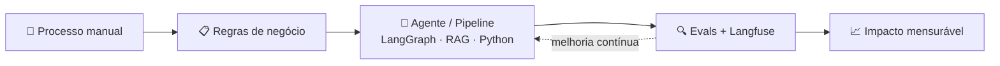

<div align="center">


<a href="https://github.com/jullianoandrade">
  
</a>

<br/>

<a href="https://www.linkedin.com/in/jullianoandrade/"></a>
<a href="mailto:juliano.andrade.cs@gmail.com"></a>


</div>

---

### 👋 Sobre mim

```python
class Juliano:
    """Engenheiro de IA e Automação — Gravataí, RS 🇧🇷"""

    def __init__(self):
        self.idade = 21
        self.cargo = "Engenheiro de IA e Automação @ Grupo Studio"
        self.formacao = "Ciência da Computação @ Unisinos"
        self.stack = ["Python", "LangGraph", "LangChain", "RAG", "Langfuse", "PostgreSQL"]
        self.foco = ["Agentes de IA", "Automação do setor tributário", "Evals & observabilidade"]
        self.tambem = ["Mentoria técnica", "Treinamentos internos de IA aplicada"]

    def resolver(self, problema: str) -> str:
        regras = self.entender_regras_de_negocio(problema)
        solucao = self.automatizar_com_ia(regras)
        return self.medir_impacto(solucao)
```

- 🏢 Fui o **primeiro profissional de Automação** do Grupo Studio e ajudei a estruturar a área do zero
- 🧑‍🏫 Hoje também **mentoro o time** e conduzo treinamentos sobre IA aplicada ao desenvolvimento
- 💡 Meu interesse: pegar tecnologia complexa e transformar em algo **prático, confiável e acessível**

---

### 🧠 Como eu construo soluções



---

### 📈 Impacto em números

<table align="center">
  <tr>
    <td align="center" width="25%"><h2>90%+</h2>dos jobs do setor tributário automatizados*</td>
    <td align="center" width="25%"><h2>1.000+</h2>documentos fiscais processados em 3 meses</td>
    <td align="center" width="25%"><h2>1.000+</h2>clientes com comunicação personalizada em escala</td>
    <td align="center" width="25%"><h2>semanas → auto</h2>fluxo de relatórios judiciais transformado em pipeline</td>
  </tr>
</table>

<sub>* contribuição para a automação da área, em equipe.</sub>

---

### 🛠️ Stack

<div align="center">


<br/><br/>


</div>

---

### 🚀 Projetos em destaque

<details>
<summary><b>🤖 Agente de IA Conversacional para Atendimento</b> — LangGraph · RAG · Langfuse · Evals</summary>
<br/>

- Arquitetura completa em **LangGraph**, com estados, fluxos e lógica de execução do agente
- **RAG** para respostas fundamentadas na base de conhecimento
- **Langfuse** para tracing e observabilidade das interações e chamadas do modelo
- **Evals** automatizados para medir qualidade e acompanhar a evolução do agente
- Otimização de prompts, temperatura e parâmetros de inferência — da arquitetura até a entrega

</details>

<details>
<summary><b>🧾 Automação de Processos do Setor Tributário</b> — eSocial · e-CAC · Python</summary>
<br/>

- Coleta e processamento automatizado de documentos fiscais
- Operações manuais substituídas por fluxos escaláveis
- **1.000+ documentos** processados em 3 meses
- Contribuição para automatizar **mais de 90% dos jobs** do setor

</details>

<details>
<summary><b>🎯 Qualificação Inteligente de Leads</b> — Calendly · Pipedrive</summary>
<br/>

- Classificação de leads com fluxo de perguntas para medir aderência aos produtos
- Visualização do resultado com gráfico de similaridade
- Agendamento automático via **Calendly** e pipeline comercial integrado ao **Pipedrive**

</details>

<details>
<summary><b>📄 Pipeline de Notas Fiscais para o Omie</b> — Extração · Padronização · Integração</summary>
<br/>

- Extração, tratamento e padronização de dados de notas fiscais
- Processo manual transformado em fluxo escalável integrado ao **Omie**
- Menos retrabalho e mais confiabilidade nos dados

</details>

<details>
<summary><b>📊 Assistentes de IA para Análise e Insights</b> — LLMs aplicados a finanças</summary>
<br/>

- Interpretação de contratos bancários e identificação de possíveis juros abusivos
- Análise de perfis de clientes para encontrar oportunidades
- Redução do esforço manual em análises complexas

</details>

<details>
<summary><b>✉️ Comunicação Automatizada em Escala</b> — 1.000+ clientes</summary>
<br/>

- E-mails personalizados gerados em escala
- Relatórios individualizados para acompanhamento de processos judiciais
- Um fluxo que levava **semanas** virou um pipeline automatizado

</details>

---

### 📊 GitHub

<div align="center">


</div>

---

<div align="center">

**Bora conversar sobre IA aplicada, agentes ou automação?** Me chama no [LinkedIn](https://www.linkedin.com/in/jullianoandrade/) 🚀


</div>
